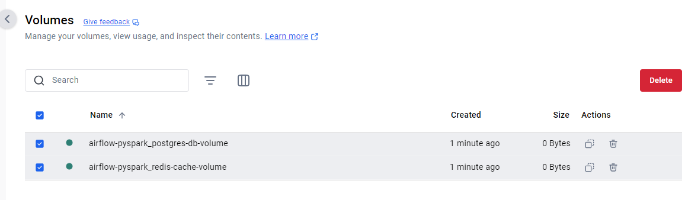

# Airflow & Spark Cluster setup with sample DAG and Spark Submit

This is a sample project illustrating how we can setup and Apache Airflow and spark cluster on docker desktop with DAG's submitting codebase in multiple languages like Python, Scala and Java submissions to the Spark cluster, illustrating an enterprise setup. 

## Description

This project is designed to setup the Apache Airflow and spark containers in the docker desktop by following the commands as listed: 

- Setup the cloned project python virtual environment to develop the DAG's and the neccesary packages installed in the environment.

    ```
    python -m venv .af
    pip install apache-airflow apache-airflow-providers-apache-spark pyspark
    python.exe -m pip install --upgrade pip
    ```

- Build the customized image of the Airflow with the neccesary packages and components installed to interact with the Spark cluster
    ```
    docker compose build
    ```

- Intialize the Airflow Postgres and Redis component
    ```
    docker compose up airflow-init
    ```

- Intialize all the airflow component services and start the services
    ```
    docker compose up
    ```

- Debug: In case any container is not starting up or for any build errors the following command comes in handy to debug as the progressigve version introduces any breaking changes
    ```
    docker run -it --entrypoint /bin/sh --user root  <<docker image ID>>
    ```

## Outcome

Now post the above services are all up and running the following can be observed:

- Running Container & Volume
    
    **Note:** The airflow-init container will remain in the stopped state as its used only  for intialization purposes. 
    

- Airflow UI (*Username: airflow* | *Password: airflow*) <br/>
    URL: [http://localhost:8080/](http://localhost:8080/) <br/> 
    DAG: spark_airflow 
    

    The above DAG is located in your cloned project (dags) folder and the associated spark submit jobs are located in the respective folders within (jobs) folder.

    

    Now the folders config/dags/jobs/logs/plugins are mapped to running containers from your project so any updated and changes to above are reflective in your workspace and running services, helping development. 

    

- Airflow to Spark Connection for Job Submission
    

- DAG run outcome
    
    

- Spark UI<br/>
  URL: [http://localhost:9090/](http://localhost:9090/)

  

## Refrences

[Airflow - Running Airflow in Docker](https://airflow.apache.org/docs/apache-airflow/2.3.2/start/docker.html) <br/>
[Airflow - Compose YAML](https://airflow.apache.org/docs/apache-airflow/2.10.5/docker-compose.yaml) <br/>
[Github - Sparking Flow](https://github.com/airscholar/SparkingFlow/tree/main) <br/>
